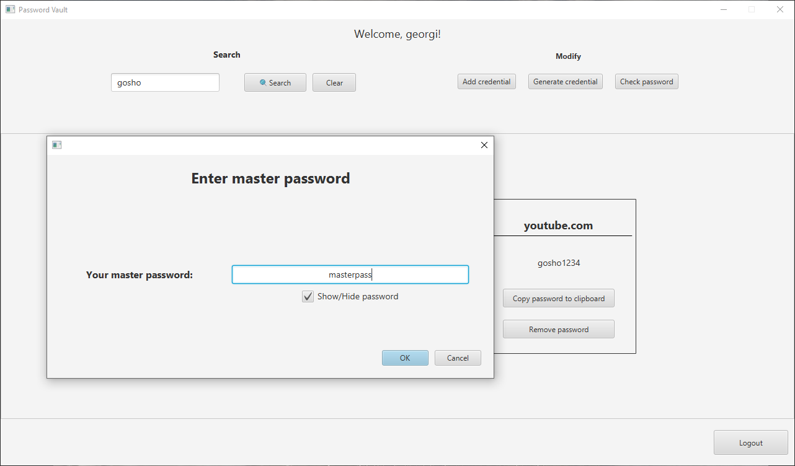

# Password vault

The aim of the project is to design and implement a client-server application that allows users to save passwords for
websites, applications or other services they use. The application provides the ability to check the strength of the
provided password via external web service and warns the user if it is weak and exposed in that database. The system
can generate a password for a specific service if users don't want to come up with one of themselves.

The client part of the system supports two options for a front-end interface - a command-line interface that
requires the user to enter text commands from a terminal and a desktop application with a graphical user interface.

## Module use diagram

## Sample screens from the application

### Login

### Add credential

### Generate credential

### Search

### Remove credential

